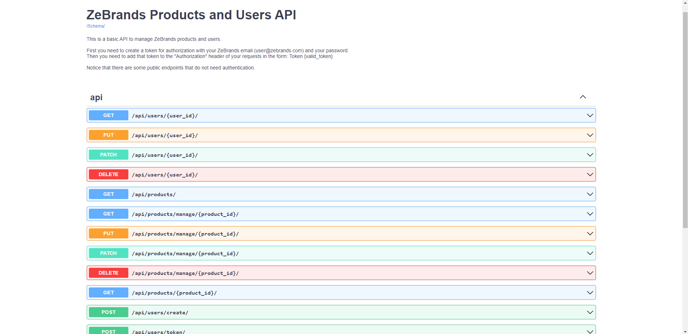

# ZeBrands Backend Test
### by Pedro Rodríguez

---

This is a simple RESTful API system to manage ZeBrands products and Users.  
A product has the following information:
- Sku
- Name
- Price
- Brand
- Visits

Only authenticated users can create, update and delete products, as well as users.

Each time an anonymous user visits a product, the product `visits` field is incremented.

Also, whenever a user updates the information of a product, a Slack notification is sent, 
noticing the change in the product to all users.

The authentication of the private endpoints is based in Token Authorization.

## Running the application

### Pre-requisites

- Install `Docker` in your local machine ([Here](https://docs.docker.com/engine/install/) are the installation instructions)
- Have a `Slack Webhook`, which will point to your Slack Channel that will receive product update alerts.  
If you don't know how to do that, you can follow
  [these fairly simple instructions](https://api.slack.com/messaging/webhooks).
  
### Starting the app

- Clone this codebase to your local machine using `git`
- **Change your Slack WebHook** you must put your `Slack Webhook` in the env 
  variable `SLACK_WEBHOOK` inside the [docker-compose file ](docker-compose.yml)
  in order to get the product update alerts in your correct Slack channel.  
- From CLI Navigate to the project's folder.
- Build our docker image using the command `docker-compose build`.  
  This will build a docker image with the requirements to run the application.
- Once our Docker image is built, exec the command `docker-compose up`.
  This will start two Docker containers one for the Database (db) and the other one for the Webapp (app).
- Now that we have our containers running, go to your explorer and enter the `localhost:8000` site

### Using the API

Once you are in the API home page, you will see the available `APIs` and `Schemas`.  
Since you are not authenticated you will only be able to see the public endpoints:

The app has a default admin user, created for you.  
So, in orther to get an authorization token for the first time, make a POST request to the
`api/users/token/` endpoint with the following credentials:  
**user:** `admin@zebrands.com`  
**password:** `admin`

This will return an `authorization token` in the Response body:

It is a good idea to have an extension to modificate the header of your browser's requests.  
I prefer [ModHeader Extension](https://chrome.google.com/webstore/detail/modheader/idgpnmonknjnojddfkpgkljpfnnfcklj?hl=es) for Chrome.  
Once installed you must set your header content to:
'Authorization': 'Token `your authorization token`'

With this, our app knows that you are authenticated, refresh the 
page, and now you will see the entire enpoints of the system:

Henceforth, you will be able to manage ZeBrands products and users.

You can test the API endpoints with:
- The `Swagger UI`
- Accessing directly to the endpoints `in your browser`.
- Using `CURL commands`.
- With 3rd party applications like `Postman`.

**Just don't forget to add your `authorization token` in 
your`request header`when testing `private endpoints`.**

**NOTE:** Whenever you update a product, you will get a notification as follows in your Slack Channel:

### Running Unit tests

To run the unit tests, execute the following command:  
`docker-compose run --rm app sh -c "python manage.py test -v 2"`

## Technical Information

This application was developed from scratch using the following stack:

- **Python** as the main programming language
- **Django framework** with class based views to create the RESTful API
- **PostgreSQL** for the Database, with psycopg2 adapter
- **Docker** to *containerize* the application
- **Swagger** for quick, easy and clean API endpoints documentation
- **PyTest** for unit testing
- **GitHub** for version control and development organization (Branches, Pull Requests, etc.)
- **Slack API** 3rd party API to send the notification when the information of a product is updated

### Execute any command inside the Docker container

-  `docker-compose run --rm app sh -c "{command}"`
